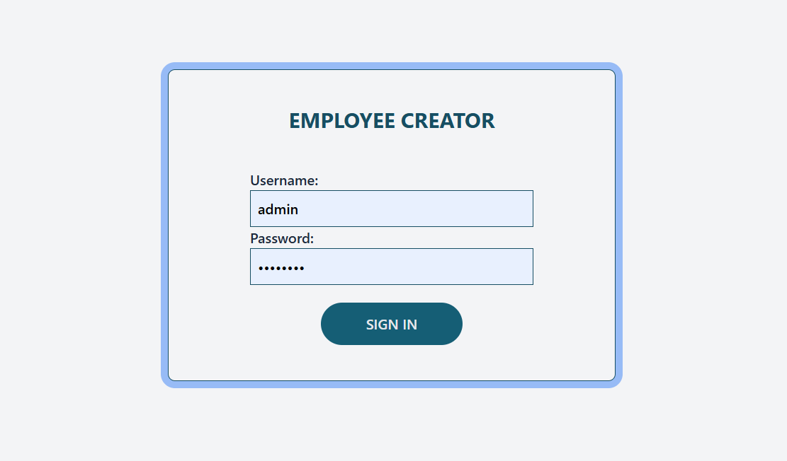

# Employee Creator
## Demo & Snippets
Login: 
            _User ADMIN_                              _User 2_
username: admin password: password           username: user password: password
### Login Page

### Dashboard with search and filters

### Ordinary User View without Edit, Delete and Add

### Employee Description

### Employee Edit/Add Form With Error Handling

### Employees Summary Report

## Project Description
A full-stack web application that creates, lists, modifies and deletes employees and summarises employees data.

## Stack Used
Pyhton Flask (back-end)
Typescript (front-end)
POSTGRESQL (Database)

## Design Goals / Approach

### FrontEnd
- Authentication from server-side is used to render elements on the page. Add, delete, edit and view more buttons are displayed for an admin user only.
- The filters are based on 3 different fields along with a search and sort for names. These all form query parameters to the API call to the backend and Redux is used to manage them.
- Whenever filters change the query parameters in *Redux* are updated. These are linked to *TanStack* get query arguments which uses *axios* to make API calls.
- *React Form* is used as an edit/ add employee form and error handling is done using *zod* resolver
- *useRef* is used to read data from filters and login forms
- Employee data is brought in form of _pages_. In order to test pagination, *data faker* library was used to seed data in the database.

### Backend
- Backend is build with flask
- Summaries are generated using PySpark
## Features
- _Authenticates_ the user before giving him access to the dashboard
- The users can have a "user" _role_ or an "admin" role. 
- _Add, Delete, View More and Edit rights_ are only available to admin
- Admin can add and edit the _employee form page_
- _Filtering_ can be done on various fields
- _Search_ is available for names
- _Sorting_ by names is also available  
- _Responsive_ frontend- The columns of the table disappear as the screen size becomes smaller.
- Report that summarises employee data

